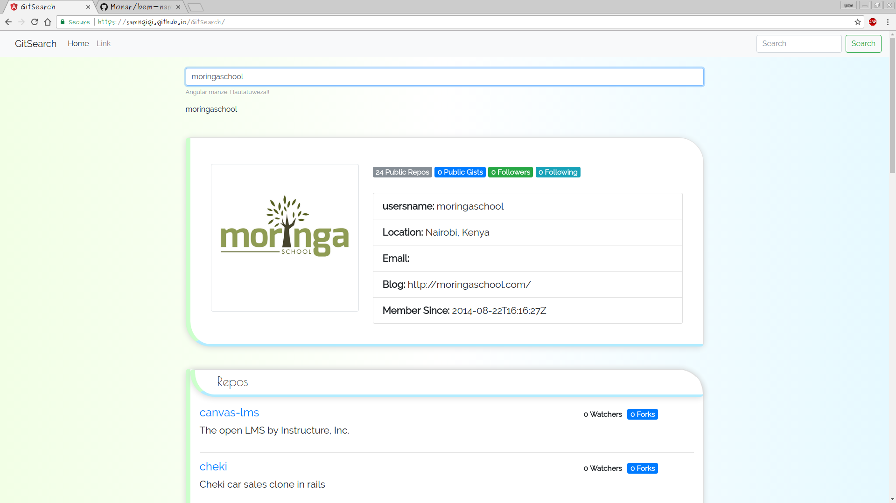

GitSearch
=======================


**This is a GitHub user and repo search web application that uses the github api**


The site welcomes you with a simple but styled u.i, with a navbar, search form  and cards displaying a default user and repo. Just;


- Key in username you want to find on Github.
- The cards will respond and display matching the username typed  
- The profile avatar and brief details will be displayed in main card.
- Repositories will be listed in card below.
- click on interested repository in result to go to users repo.

### Technologies used
This site was build using :
``` 
 HTML
 CSS
 JavaScript
jQuery
 Bootstrap
 Angular 5
TypeScript
```

## Project live site

------------

#### Credits


------------

License
-------

MIT License

Copyright (c) [2017] [Sam Ngigi]

Permission is hereby granted, free of charge, to any person obtaining a copy
of this software and associated documentation files (the "Software"), to deal
in the Software without restriction, including without limitation the rights
to use, copy, modify, merge, publish, distribute, sublicense, and/or sell
copies of the Software, and to permit persons to whom the Software is
furnished to do so, subject to the following conditions:

The above copyright notice and this permission notice shall be included in all
copies or substantial portions of the Software.

THE SOFTWARE IS PROVIDED "AS IS", WITHOUT WARRANTY OF ANY KIND, EXPRESS OR
IMPLIED, INCLUDING BUT NOT LIMITED TO THE WARRANTIES OF MERCHANTABILITY,
FITNESS FOR A PARTICULAR PURPOSE AND NONINFRINGEMENT. IN NO EVENT SHALL THE
AUTHORS OR COPYRIGHT HOLDERS BE LIABLE FOR ANY CLAIM, DAMAGES OR OTHER
LIABILITY, WHETHER IN AN ACTION OF CONTRACT, TORT OR OTHERWISE, ARISING FROM,
OUT OF OR IN CONNECTION WITH THE SOFTWARE OR THE USE OR OTHER DEALINGS IN THE
SOFTWARE.
